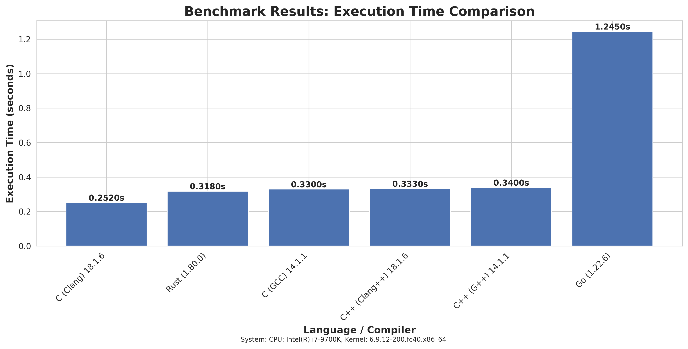

## Source Code & Benchmark Scripts

| Language | Source File |
|----------|-------------|
| C        | [`benchmark.c`](benchmark.c) |
| C++      | [`benchmark.cpp`](benchmark.cpp) |
| Rust     | [`benchmark.rs`](benchmark.rs) |
| Go       | [`benchmark.go`](benchmark.go) |


## Run benchmark
[run_benchmark.py](run_benchmark.py)

``` 
cd benchmark-c-vs-all
python3 run_benchmark.py
```

## Contributing

We aim to maintain a fair and accurate benchmark. 
If you have suggestions for improvement, please consider submitting a pull request with any of the following:

- A new programming language implementation
- Updated source code for an existing language to ensure fairness
- Refined optimization options for a particular implementation

Your contributions are welcome and will help enhance the quality of this benchmark.

## License

Distributed under the MIT License. See LICENSE for more information.

## Contact
Name:  Sergey Veneckiy   

Email: s.venetsky@gmail.com
